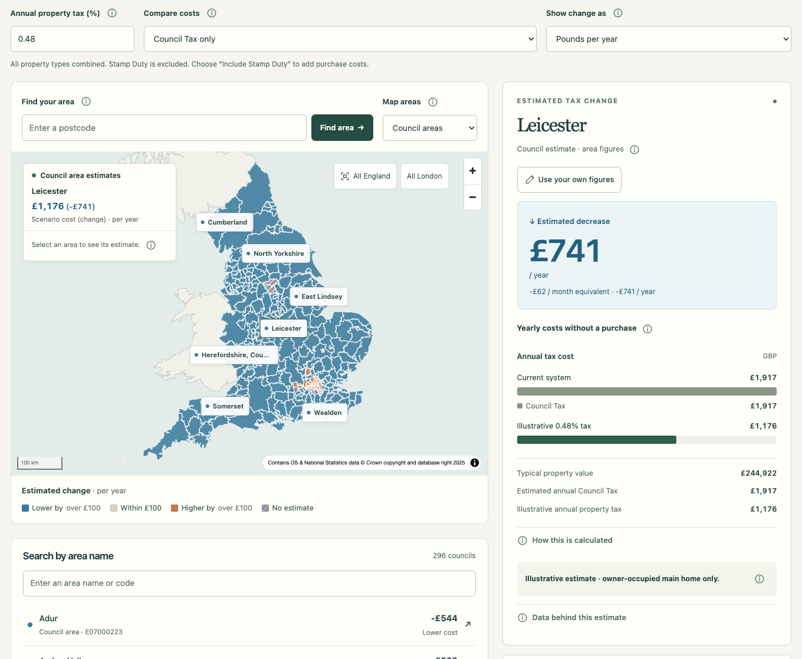

# Tax Map

Explore how an illustrative property-tax reform could affect a typical home in England. Compare Council Tax with an annual property tax, adjust the rate, and optionally include Stamp Duty.

**[Try the live demo](https://taxmap.limsight.com/)**



## Stack

- SvelteKit (static build)
- MapLibre GL JS
- Python (offline data pipeline)

## Development

Use Node.js **22.14.0 or newer**:

```sh
npm ci
npm run dev
```

Open the local URL printed by Vite. The data is included; no API keys are needed.

Useful commands:

```sh
npm run check
npm test
npm run build
```

See [CONTRIBUTING.md](CONTRIBUTING.md) for the full checks and [pipeline/README.md](pipeline/README.md) to rebuild datasets.

## Data and credits

Uses official data from ONS, HM Land Registry, VOA/HMRC and MHCLG. Some areas have no usable estimate. Results are illustrative, not personal tax advice.

See the [methodology](docs/methodology.md) and [data licences and attribution](DATA-LICENSES.md).

## Licence

[MIT](LICENSE) for original code and documentation. Data, map assets and dependencies retain their own licences.
